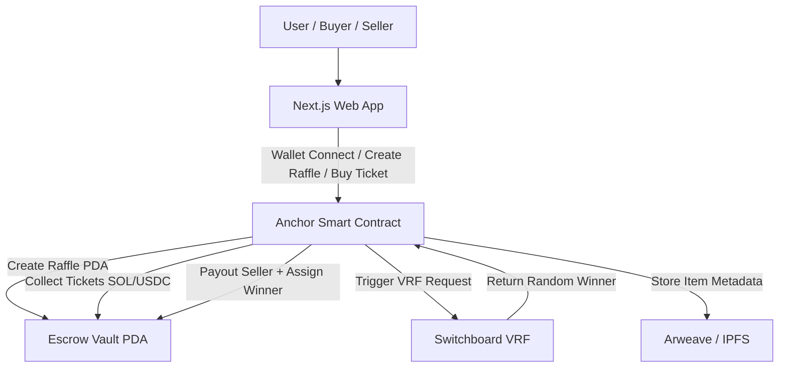
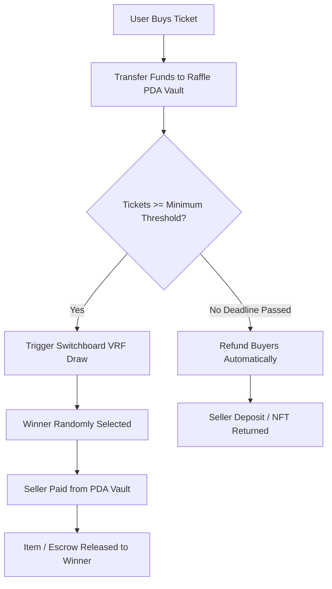

# RaffleDrop 

🎯 Overview

LuckyBid is a decentralized raffle-style marketplace where anyone can sell real-world or digital products, and buyers participate for a chance to win them at a fraction of the cost. Once the minimum funding goal (tickets sold) is met, a verifiably-random winner is selected using Switchboard VRF — ensuring fairness, transparency, and zero-trust execution on the Solana blockchain.

✨ Key Features

💰 Seller Guarantee: Sellers receive the full selling price when the raffle concludes successfully  
🎟️ Affordable Participation: Buyers pay only a small entry fee for a chance to win high-value items  
⚖️ Provably Fair Selection: Winners are chosen using verifiable on-chain randomness (Switchboard VRF)  
📜 Smart-Legal Contracts: Optional legally-binding agreements prevent sellers from listing products elsewhere  
🔒 Secure Escrow: All funds are held in Program Derived Address (PDA) vaults until conditions are met  

🏗️ System Architecture


🪙 Payment Flow



🚀 Quick Start

### Step 1: Install dependencies
```bash
pnpm install
```

### Step 2: Sync program ID
```bash
pnpm anchor keys sync
```

### Step 3: Build the program
```bash
pnpm anchor build
```

### Step 4: Deploy to devnet
```bash
pnpm anchor deploy --provider.cluster devnet
```

### Step 5: Start the frontend
```bash
pnpm dev
```

### Notes:
- Ensure you have `pnpm` installed globally. If not, install it using:
  ```bash
  npm install -g pnpm
  ```
- Make sure you have Solana CLI and Anchor CLI installed and configured properly. Refer to the [Anchor documentation](https://project-serum.github.io/anchor/getting-started/installation.html) for setup instructions.
- Replace `--provider.cluster devnet` with `--provider.cluster mainnet` for deploying to the mainnet.
