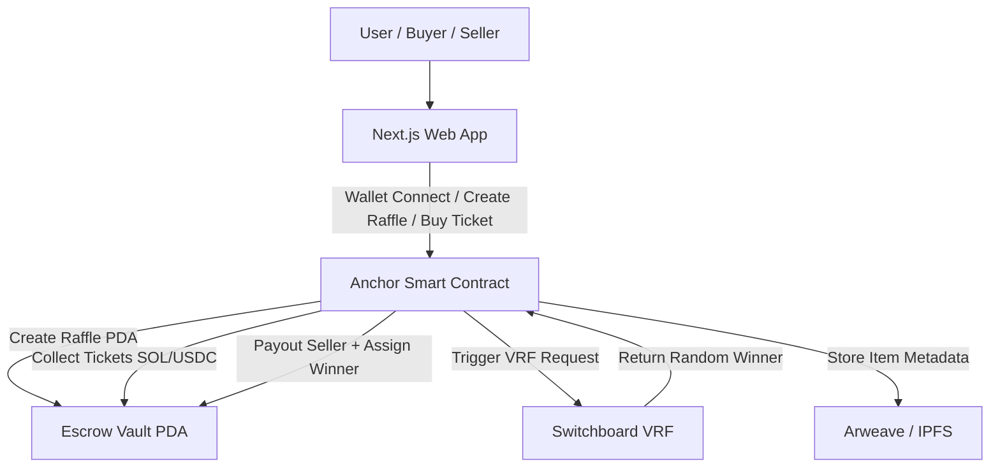
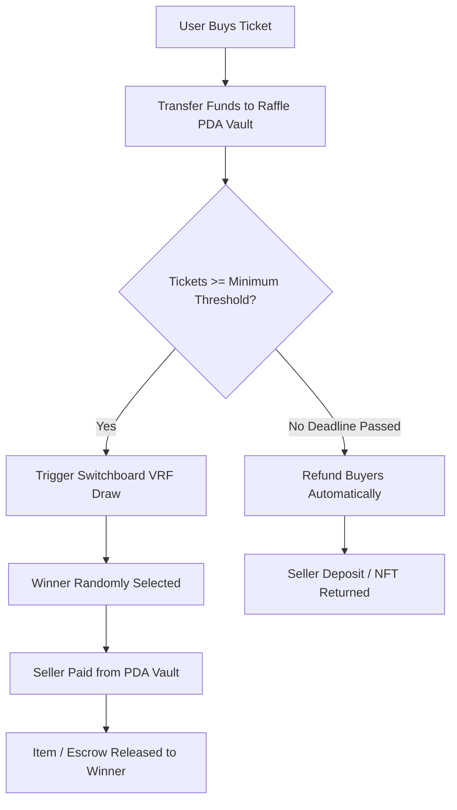

# RaffleDrop 

🎯 Overview

LuckyBid is a decentralized raffle-style marketplace where anyone can sell real-world or digital products, and buyers participate for a chance to win them at a fraction of the cost. Once the minimum funding goal (tickets sold) is met, a verifiably-random winner is selected using Switchboard VRF — ensuring fairness, transparency, and zero-trust execution on the Solana blockchain.

✨ Key Features

💰 Seller Guarantee: Sellers receive the full selling price when the raffle concludes successfully
🎟️ Affordable Participation: Buyers pay only a small entry fee for a chance to win high-value items
⚖️ Provably Fair Selection: Winners are chosen using verifiable on-chain randomness (Switchboard VRF)
📜 Smart-Legal Contracts: Optional legally-binding agreements prevent sellers from listing products elsewhere
🔒 Secure Escrow: All funds are held in Program Derived Address (PDA) vaults until conditions are met

🏗️ System Architecture

🪙 Payment Flow

# 🚀 Getting Started

# Prerequisites

Node.js (v18 or later)
Solana CLI tools
Rust and Anchor CLI
Phantom or other Solana wallet

# Install dependencies
pnpm install

# Or create this template fresh:
pnpm create solana-dapp@latest -t gh:solana-foundation/templates/web3js/RaffleDrop

# Anchor Program Setup

Sync Program ID

Creates a deploy keypair → writes ID to config → updates declare_id! macro.
pnpm anchor keys sync

# Build Program
pnpm anchor-build

# Deploy to Devnet
pnpm anchor deploy --provider.cluster devnet

